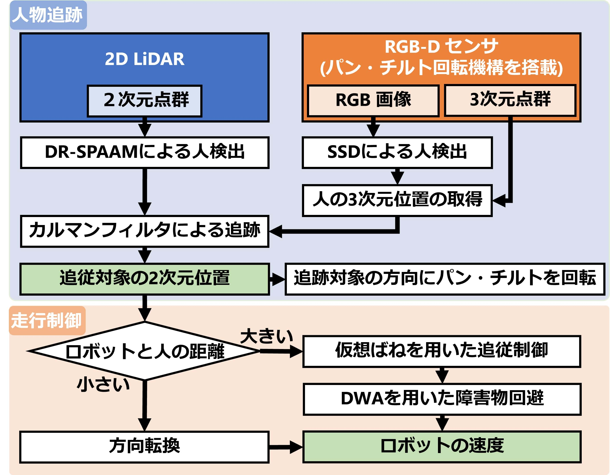
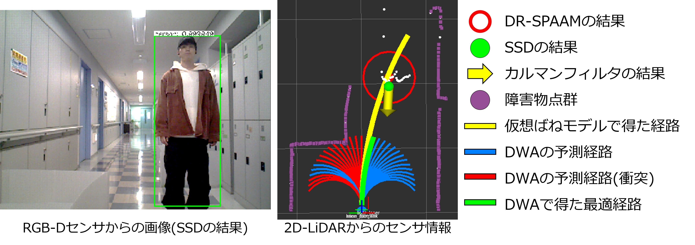
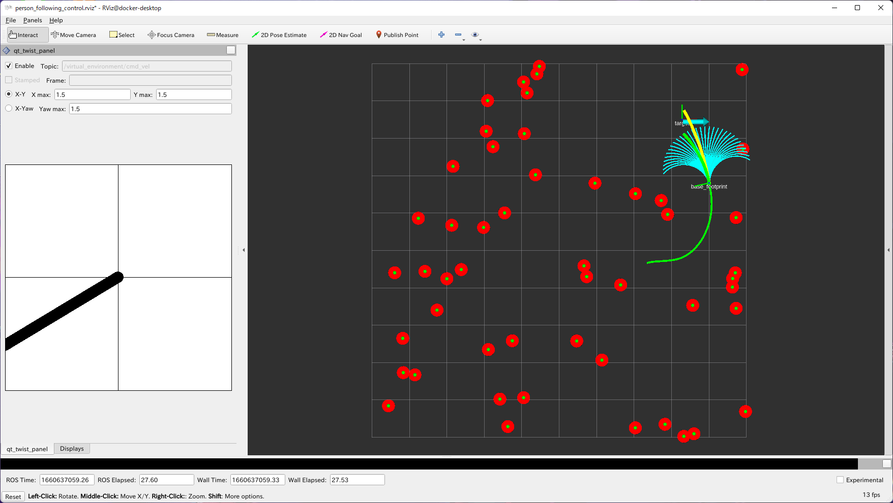
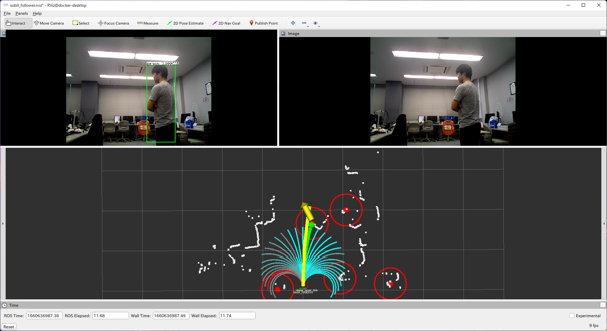

<a name="readme-top"></a>

[JA](README.md) | [EN](README.en.md)

[![Contributors][contributors-shield]][contributors-url]
[![Forks][forks-shield]][forks-url]
[![Stargazers][stars-shield]][stars-url]
[![Issues][issues-shield]][issues-url]
[![License][license-shield]][license-url]

# SOBIT Follower

<!-- 目次 -->
<details>
  <summary>目次</summary>
  <ol>
    <li>
      <a href="#概要">概要</a>
    </li>
    <li>
      <a href="#環境構築">環境構築</a>
      <ul>
        <li><a href="#環境条件">環境条件</a></li>
        <li><a href="#インストール方法">インストール方法</a></li>
      </ul>
    </li>
    <li>
    　<a href="#実行操作方法">実行・操作方法</a>
      <ul>
        <li><a href="#移動機構のみを使用する場合">移動機構のみを使用する場合</a></li>
        <li><a href="#Rviz上の可視化">Rviz上の可視化</a></li>
      </ul>
    </li>
    <li>
    　<a href="#ソフトウェア">ソフトウェア</a>
      <ul>
        <li><a href="#ジョイントコントローラ">ジョイントコントローラ</a></li>
        <li><a href="#ホイルコントローラ">ホイルコントローラ</a></li>
      </ul>
    </li>
    <li>
    　<a href="#ハードウェア">ハードウェア</a>
      <ul>
        <li><a href="#パーツのダウンロード方法">パーツのダウンロード方法</a></li>
        <li><a href="#電子回路図">電子回路図</a></li>
        <li><a href="#ロボットの組み立て">ロボットの組み立て</a></li>
        <li><a href="#ロボットの特徴">ロボットの特徴</a></li>
        <li><a href="#部品リストBOM">部品リスト（BOM）</a></li>
      </ul>
    </li>
    <li><a href="#マイルストーン">マイルストーン</a></li>
    <!-- <li><a href="#contributing">Contributing</a></li> -->
    <!-- <li><a href="#license">License</a></li> -->
    <li><a href="#参考文献">参考文献</a></li>
  </ol>
</details>

##概要
- 複数のセンサを用いたロボットの人追従走行システム(SOBIT EDU, SOBIT PROで使用可能)
- [論文](sobit_follower/doc/murakami_daiki_Master_research_summary.pdf)
- [LRFとパン・チルト回転機構上のRGB-Dセンサを用いた人追従走行ロボットの開発](https://www.jstage.jst.go.jp/article/jsmermd/2021/0/2021_1P2-G07/_article/-char/ja/)

<div align="center">
    
    
</div>

## Setup
```python
$ cd ~/catkin_ws/src/
$ git clone https://github.com/TeamSOBITS/sobit_follower
$ cd sobit_follower
# follow meに必要なパッケージのインストールを行う
$ bash install.sh
# インストールしたパッケージのセットアップを行った後、catkin_make
$ cd ~/catkin_ws
$ catkin_make
```

## Package Configuration
### 01. 2D Lidar Person Detection
- DR-SPAAMによる2次元点群脚検出
- [GitHub：Person Detection in 2D Range Data](https://github.com/VisualComputingInstitute/2D_lidar_person_detection)をPython3で動作するように改良したもの
- Multiple Sensor Person Trackingで使用
- 詳細は[こちら](2d_lidar_person_detection)

### 02. Multiple Observation Kalman Filter
- 2つの観測値を入力とするカルマンフィルタライブラリ
- 1つの観測値でも動作可能
-　状態方程式は等速モデル
- Multiple Sensor Person Trackingで使用
- 詳細は[こちら](multiple_observation_kalman_filter)

### 03. Multiple Sensor Person Tracking
- 2D-LiDARセンサ(URG)とパンチルト回転機構上のRGB-Dセンサ(xtion)を組み合わせた人物追跡
- DR-SPAAMによる2次元点群脚検出とSSDによる画像人検出を用いた人物追跡
- 詳細は[こちら](multiple_sensor_person_tracking)

<!-- <div align="center">
    
</div> -->

### 04. Person Following Control
- 仮想ばねモデルを用いた人間追従制御にDynamic Window Approachによる障害物回避を組み込んだ走行制御
- 詳細は[こちら](person_following_control)

<!-- <div align="center">
    
</div> -->

### 05. SOBIT Follower
- Multiple Sensor Person TrackingとPerson Following Controlを用いた人追従走行
- ユーザはこのパッケージのLaunchを起動することで人追従走行を動作させることが可能
- 実験用のrosbag取得や取得したデータのplotも可能なシェルスクリプトも完備
- 詳細は[こちら](sobit_follower)

## How to Use
### [follower_me.launch](sobit_follower/launch/follower_me.launch)
- Multiple Sensor Person TrackingとPerson Following Controlを用いた人追従走行
- path：`sobit_follower/launch/follower_me.launch`
- 詳細は[こちら](sobit_follower)
```python
$ roslaunch sobit_follower follower_me.launch rviz:=false rqt_reconfigure:=false use_rotate:=true use_smoother:=true
# 引数
# rviz : Rvizを起動するか(bool)
# rqt_reconfigure : rqt_reconfigureを起動するか(bool)
# use_rotate : SensorRotatorを起動するか(bool)
# use_smoother : 速度の平滑化を行うか(bool)
```
※SOBIT EDU，RGB-Dセンサ，2D LiDARの起動をすること

#### Launch Configuration
- [tracker.launch.xml](sobit_follower/launch/include/tracker.launch.xml)
    - 2D-LiDARセンサ(URG)とパンチルト回転機構上のRGB-Dセンサ(xtion)を組み合わせた人物追跡
    - path：`sobit_follower/launch/include/tracker.launch.xml`
    - 詳細は[こちら](sobit_follower#trackerlaunchxml)
- [ssd_pose_ros.launch.xml](sobit_follower/launch/include/ssd_pose_ros.launch.xml)
    - RGB画像ベースの人物検出器
    - path：`sobit_follower/launch/include/ssd_pose_ros.launch.xml`
    - 詳細は[こちら](sobit_follower#ssd_pose_roslaunchxml)
- [dr_spaam_ros.launch.xml](sobit_follower/launch/include/dr_spaam_ros.launch.xml)
    - 2D LiDARベースの人物検出器
    - path：`sobit_follower/launch/include/dr_spaam_ros.launch.xml`
    - 詳細は[こちら](sobit_follower#dr_spaam_roslaunchxml)
- [person_following_control.launch.xml](sobit_follower/launch/include/person_following_control.launch.xml)
    - 仮想ばねモデルを用いた追従制御にDynamic Window Approachによる障害物回避を組み込んだ走行制御
    - path：`sobit_follower/launch/include/person_following_control.launch.xml`
    - 詳細は[こちら](sobit_follower#person_following_controllaunchxml)

#### Parameter file
- [tracker_param.yaml](sobit_follower/param/tracker_param.yaml)
    - 人物追跡に関するパラメータ
    - path：`sobit_follower/param/tracker_param.launch.xml`
    - パラメータの詳細は[こちら](sobit_follower#parametersperson_tracker)
- [ssd_param.yaml](sobit_follower/param/ssd_param.yaml)
    - RGB画像ベースの人物検出器に関するパラメータ
    - path：`sobit_follower/param/ssd_param.launch.xml`
    - パラメータの詳細は[こちら](sobit_follower#parameters)
- [dr_spaam_param.yaml](sobit_follower/param/dr_spaam_param.yaml)
    - 2D LiDARベースの人物検出器に関するパラメータ
    - path：`sobit_follower/param/dr_spaam_param.launch.xml`
    - パラメータの詳細は[こちら](sobit_follower#parameters-1)
- [sensor_rotator_param.yaml](sobit_follower/param/sensor_rotator_param.yaml)
    - RGB-Dセンサのパンチルト回転制御に関するパラメータ
    - path：`sobit_follower/param/sensor_rotator_param.launch.xml`
- [following_control_param.yaml](sobit_follower/param/following_control_param.yaml)
    - 走行制御に関するパラメータ
    - path：`sobit_follower/param/following_control_param.launch.xml`
    - パラメータの詳細は[こちら](sobit_follower##parameterfollowing-control)
- [velocity_smoother_param.yaml](sobit_follower/param/velocity_smoother_param.yaml)
    - 速度平滑化に関するパラメータ
    - path：`sobit_follower/param/velocity_smoother_param.launch.xml`

### [simulator.launch](sobit_follower/launch/simulator.launch)
- 仮想的にセンサデータをパブリッシュして，follower_me.launchの動作を確認
- path：`sobit_follower/launch/simulator.launch`
```python
$ roslaunch sobit_follower simulator.launch rviz:=true rqt_reconfigure:=true
# 引数
# rviz : Rvizを起動するか(bool)
# rqt_reconfigure : rqt_reconfigureを起動するか(bool)
```
<div align="center">
    
</div>

<!-- マイルストーン -->
## マイルストーン

- [x] OSS
    - [x] ドキュメンテーションの充実
    - [x] コーディングスタイルの統一

現時点のバッグや新規機能の依頼を確認するために[Issueページ][license-url] をご覧ください．

<p align="right">(<a href="#readme-top">上に戻る</a>)</p>


<!-- CONTRIBUTING -->
<!-- ## Contributing

Contributions are what make the open source community such an amazing place to learn, inspire, and create. Any contributions you make are **greatly appreciated**.

If you have a suggestion that would make this better, please fork the repo and create a pull request. You can also simply open an issue with the tag "enhancement".
Don't forget to give the project a star! Thanks again!

1. Fork the Project
2. Create your Feature Branch (`git checkout -b feature/AmazingFeature`)
3. Commit your Changes (`git commit -m 'Add some AmazingFeature'`)
4. Push to the Branch (`git push origin feature/AmazingFeature`)
5. Open a Pull Request

<p align="right">(<a href="#readme-top">上に戻る</a>)</p> -->


<!-- LICENSE -->
<!-- ## License

Distributed under the MIT License. See `LICENSE.txt` for more NOTErmation.

<p align="right">(<a href="#readme-top">上に戻る</a>)</p> -->
<!-- MARKDOWN LINKS & IMAGES -->
<!-- https://www.markdownguide.org/basic-syntax/#reference-style-links -->
[contributors-shield]: https://img.shields.io/github/contributors/TeamSOBITS/sobit_follower.svg?style=for-the-badge
[contributors-url]: https://github.com/TeamSOBITS/sobit_follower/graphs/contributors
[forks-shield]: https://img.shields.io/github/forks/TeamSOBITS/sobit_follower.svg?style=for-the-badge
[forks-url]: https://github.com/TeamSOBITS/sobit_follower/network/members
[stars-shield]: https://img.shields.io/github/stars/TeamSOBITS/sobit_follower.svg?style=for-the-badge
[stars-url]: https://github.com/TeamSOBITS/sobit_follower/stargazers
[issues-shield]: https://img.shields.io/github/issues/TeamSOBITS/sobit_follower.svg?style=for-the-badge
[issues-url]: https://github.com/TeamSOBITS/sobit_follower/issues
[license-shield]: https://img.shields.io/github/license/TeamSOBITS/sobit_follower.svg?style=for-the-badge
[license-url]: LICENSE