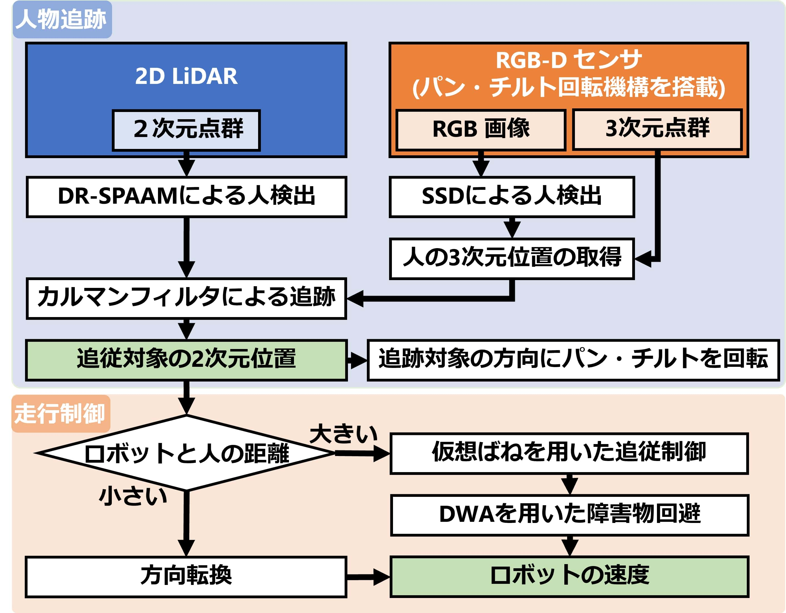
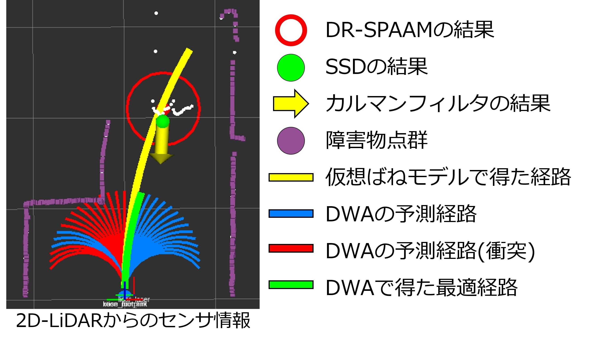
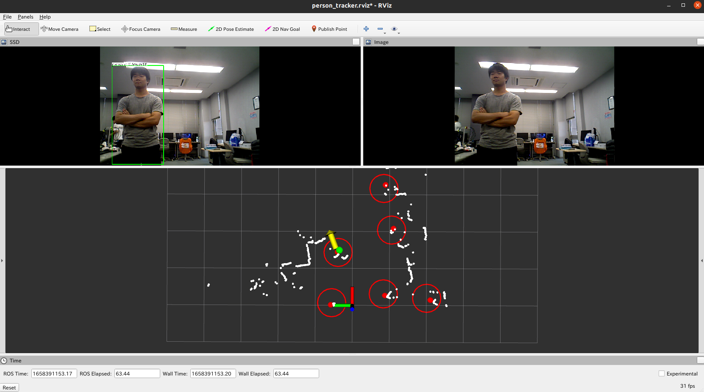
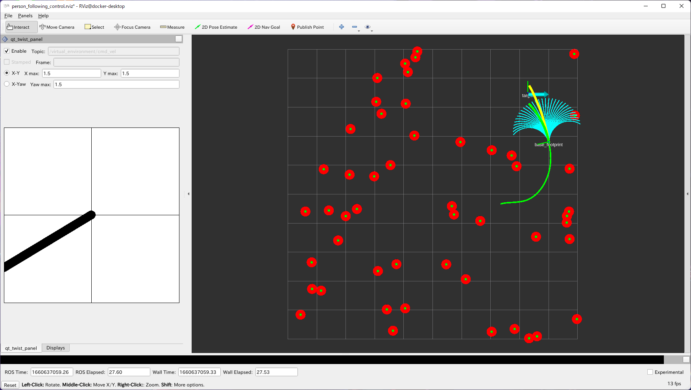

<a name="readme-top"></a>

[JA](README.md) | [EN](README.en.md)

[![Contributors][contributors-shield]][contributors-url]
[![Forks][forks-shield]][forks-url]
[![Stargazers][stars-shield]][stars-url]
[![Issues][issues-shield]][issues-url]
[![License][license-shield]][license-url]

# SOBIT Follower

<!-- Table of Contents -->
<details>
  <summary>Table of Contents</summary>
  <ol>
    <li>
      <a href="#summary">Summary</a>
    </li>
    <li>
      <a href="#setup">Setup</a>
      <a href="#Additional setup for target identification">Additional setup for target identification</a>
    </li>
    <li>
    　<a href="#package-configuration">Package Configuration</a>
      <ul>
        <li><a href="#01-2d-lidar-person-detection">01. 2D Lidar Person Detection</a></li>
        <li><a href="#02-multiple-observation-kalman-filter">02. Multiple Observation Kalman Filter</a></li>
        <li><a href="#03-multiple-sensor-person-tracking">03. Multiple Sensor Person Tracking</a></li>
        <li><a href="#04-person-following-control">04. Person Following Control</a></li>
        <li><a href="#05-sobit-follower">05. SOBIT Follower</a></li>
        <li><a href="#06-target-identification-method">06. Target Identification Method</a></li>
      </ul>
    </li>
    <li>
    　<a href="#launch-and-usage">Launch and Usage</a>
      <ul>
        <li><a href="#launch-configuration">Launch Configuration</a></li>
        <li><a href="#parameter-file">Parameter file</a></li>
      </ul>
    </li>
    <li><a href="#milestone">Milestone</a></li>
    <!-- <li><a href="#contributing">Contributing</a></li> -->
    <!-- <li><a href="#license">License</a></li> -->
    <!-- <li><a href="#acknowledgments">Acknowledgments</a></li> -->
  </ol>
</details>

## Summary
- Robot person-following system with multiple sensors (usable with SOBIT EDU and SOBIT PRO)
<!-- - [論文](sobit_follower/doc/murakami_daiki_Master_research_summary.pdf) -->
- [Development of a person-following  robot using LRF and RGB-D sensor on the pan-tilt-rotate mechanism](https://www.jstage.jst.go.jp/article/jsmermd/2021/0/2021_1P2-G07/_article/-char/ja/)

<div align="center">
    
    
</div>

## Setup
```python
$ cd ~/catkin_ws/src/
$ git clone https://github.com/TeamSOBITS/sobit_follower
$ cd sobit_follower
# Install the necessary packages for follow me
$ bash install.sh
# Setup the installed package, then catkin_make
$ cd ~/catkin_ws
$ catkin_make
```

## Additional setup for target identification
```python
$ cd sobit_follower
# Installing additional packages required for target identification
$ bash install_target_identification.sh
# Setup the installed package, then catkin_make
$ cd ~/catkin_ws
$ catkin_make
```

## Package Configuration
### 01. 2D Lidar Person Detection
- 2D Point Cloud Leg Detection with DR-SPAAM
- [GitHub：Person Detection in 2D Range Data](https://github.com/VisualComputingInstitute/2D_lidar_person_detection) modified to work with Python3
- Used in Multiple Sensor Person Tracking
- [For more information](2d_lidar_person_detection)

### 02. Multiple Observation Kalman Filter
- Kalman filter library with two observables as input
- Can also work with a single observation
- Equation of state is a constant velocity model
- Used in Multiple Sensor Person Tracking
- [For more information](multiple_observation_kalman_filter)

### 03. Multiple Sensor Person Tracking
- Person tracking using a 2D-LiDAR sensor combined with an RGB-D sensor on a pan-tilt rotation mechanism
- Person tracking using 2D point cloud leg detection with DR-SPAAM and person detection with SSD
- [For more information](multiple_sensor_person_tracking)

<!-- <div align="center">
    
</div> -->

### 04. Person Following Control
- Person-following control using a Virtual Spring Model with obstacle avoidance by Dynamic Window Approach
- [For more information](person_following_control)

<!-- <div align="center">
    
</div> -->

### 05. SOBIT Follower
- Person-following control using Multiple Sensor Person Tracking and Person Following Control
- Users can activate person-following by launching this package's Launch
- Shell scripts are also available to acquire rosbags for experiments and plot the acquired data
- [For more information](sobit_follower)

### 06. Target Identification Method
- Person-following run with additional target identification methods
- By adding one of the following two methods to the person-following robot system, the robot can follow the target while identifying the target person

Target Identification Method
1. Combination of convolutional channel function and online boosting(Koide_Model)
    - Consists of human feature extraction by pixel value summation of random rectangles based on 10 feature maps and a target classifier by online boosting
    - Additional packages are [monocular_person_following](https://github.com/TeamSOBITS/monocular_person_following) and [ccf_person_identification](https://github.com/TeamSOBITS/ccf_person_identification), and [open_face_recognition](https://github.com/TeamSOBITS/open_face_recognition) needs to be added depending on these two packages
    - Paper:
    - - Kenji Koide, Jun Miura, and Emanuele Menegatti， “Monocular person tracking and identification with on-line deep feature selection for person following robots”，Robotics and Autonomous Systems，124: 103348，2020 [[link]](https://staff.aist.go.jp/k.koide/assets/pdf/ias15_ext.pdf).

2. Combination of OSNet and Ridge Regression Model (GRR_SLT)
    - Consists of human feature extraction using OSNet and target classifier using ridge regression model
    - The package that needs to be added is [MPF_GRR_SLT](https://github.com/TeamSOBITS/MPF_GRR_SLT)
        - The original package of MPF_GRR_SLT does not use OSNet as a human feature extraction method. However, OSNet is used instead as a human feature extraction method when applying the target person identification function to sobit_follwer
    - OSNet github: [[link]](https://github.com/KaiyangZhou/deep-person-reid)
    - OSNet paper:
    - Kaiyang Zhou，Yongxin Yang，Andrea Cavallaro and Tao Xiang，“Omni-scale feature learning for person re-identification”，Proceedings of the IEEE/CVF international conference on computer vision，pp.3702-3712，2019  [[link]](https://openaccess.thecvf.com/content_ICCV_2019/papers/Zhou_Omni-Scale_Feature_Learning_for_Person_Re-Identification_ICCV_2019_paper.pdf).
    - MPF_GRR_SLT(the underlying package for this target identification method(the original target classifier with ridge regression model is still used)) Paper:
    - Hanjing Ye，Jieting Zhao，Yaling Pan，Weinan Chen and Hong Zhang，“Following Closely: A Robust Monocular Person Following System for Mobile Robot”，arXiv preprint arXiv:2204.10540，2022 [[link]](https://arxiv.org/pdf/2204.10540).

- Target identification experiments show that GRR_SLT is more accurate than Koide_Model
- On the other hand, Koide_Model has the advantage of less processing than GRR_SLT, so it is recommended to use two different target identification methods depending on the situation
- The additional setup for target identification shown above can be used

## Launch and Usage
### [sobit_edu_follower_me.launch](sobit_follower/launch/sobit_edu/sobit_edu_follower_me.launch)
- Person-following control by Multiple Sensor Person Tracking and Person Following Control using SOBIT EDU
- path：`sobit_follower/launch/sobit_edu/sobit_edu_follower_me.launch`
- [For more information](sobit_follower)
```python
$ roslaunch sobit_follower sobit_edu_follower_me.launch rviz:=false rqt_reconfigure:=false use_rotate:=true use_smoother:=true
# Arguments
# rviz : whether to start Rviz (bool)
# rqt_reconfigure : whether to start rqt_reconfigure (bool)
# use_rotate : activate SensorRotator (bool)
# use_smoother : whether to perform velocity smoothing (bool)
```

### [sobit_edu_follower_me_GRRSLT.launch](sobit_follower/launch/sobit_edu/sobit_edu_follower_me_GRRSLT.launch)
- Person-following run that enables SOBIT_EDU to combine two methods of target identification(GRR_SLT) using OSNet and ridge regression model to identify the target to be followed
- path：`sobit_follower/launch/sobit_edu/sobit_edu_follower_me_GRRSLT.launch`
- YOLOv10 is used here instead of SSD for person detection
```python
$ roslaunch sobit_follower sobit_edu_follower_me_GRRSLT.launch rviz:=false rqt_reconfigure:=false use_rotate:=true use_smoother:=true
# Arguments
# rviz : whether to start Rviz (bool)
# rqt_reconfigure : whether to start rqt_reconfigure (bool)
# use_rotate : activate SensorRotator (bool)
# use_smoother : whether to perform velocity smoothing (bool)
# <include file="$(find yolov10_ros)\launch\yolov10_with_tf.launch">
#   <arg name="detect_classes" value="['person']"/>  <!-- Argument to limit the class detected by YOLO to 'person' only -->
#   <arg name="fast_shot" value="true"/>              <!-- set fast_shot to true -->
# </include>
# <include file="$(find mono_following)\launch\mono_following.launch"/>
#   The following arguments can be changed in mono_following.launch
#       <param name="initial_training_num_samples" value="50"/>  <!-- Arguments for setting the initial training count -->
#       <param name="min_target_confidence" value="-1"/>  <!-- Not particularly meaningful -->
#       <param name="id_switch_detection_thresh" value="0.65"/>  <!-- Threshold value at which a target is determined to be a target while following a target -->
#       <param name="reid_pos_confidence_thresh" value="0.65"/>  <!-- Threshold when the target is judged to be a target again while the target is lost -->
#       <param name="reid_neg_confidence_thresh" value="0.3"/>  <!-- Not particularly meaningful -->
#       <param name="reid_positive_count" value="5"/>  <!-- The number of times that the threshold of reid_pos_confidence_thresh is exceeded while the target is lost (if this number is exceeded, the target is moved to the follow-up phase) -->
```

### [sobit_edu_follower_me_KoideModel.launch](sobit_follower/launch/sobit_edu/sobit_edu_follower_me_KoideModel.launch)
- Person-following run that enables SOBIT_EDU to identify the target person to be followed by combining the target person identification method(KoideModel)
- path：`sobit_follower/launch/sobit_edu/sobit_edu_follower_me_KoideModel.launch`
- YOLOv10 is used here instead of SSD for person detection
```python
$ roslaunch sobit_follower sobit_edu_follower_me_KoideModel.launch rviz:=false rqt_reconfigure:=false use_rotate:=true use_smoother:=true
# Arguments
# rviz : whether to start Rviz (bool)
# rqt_reconfigure : whether to start rqt_reconfigure (bool)
# use_rotate : activate SensorRotator (bool)
# use_smoother : whether to perform velocity smoothing (bool)
# <include file="$(find yolov10_ros)\launch\yolov10_with_tf.launch">
#   <arg name="detect_classes" value="['person']"/>  <!-- Argument to limit the class detected by YOLO to 'person' only -->
#   <arg name="fast_shot" value="true"/>              <!-- set fast_shot to true -->
# </include>
```


### [sobit_pro_follower_me.launch](sobit_follower/launch/sobit_pro/sobit_pro_follower_me.launch)
- Person-following control by Multiple Sensor Person Tracking and Person Following Control using SOBIT PRO
- path：`sobit_follower/launch/sobit_pro/sobit_pro_follower_me.launch`
- [For more information](sobit_follower)
```python
$ roslaunch sobit_follower sobit_pro_follower_me.launch rviz:=false rqt_reconfigure:=false use_rotate:=true use_smoother:=true
# Arguments
# rviz : whether to start Rviz (bool)
# rqt_reconfigure : whether to start rqt_reconfigure (bool)
# use_rotate : activate SensorRotator (bool)
# use_smoother : whether to perform velocity smoothing (bool)
```

### [sobit_pro_follower_me_GRRSLT.launch](sobit_follower/launch/sobit_pro/sobit_pro_follower_me_GRRSLT.launch)
- Person-following run that enables SOBIT_PRO to combine two methods of target identification(GRR_SLT) using OSNet and ridge regression model to identify the target to be followed
- path：`sobit_follower/launch/sobit_pro/sobit_pro_follower_me_GRRSLT.launch`
- YOLOv10 is used here instead of SSD for person detection
```python
$ roslaunch sobit_follower sobit_pro_follower_me_GRRSLT.launch rviz:=false rqt_reconfigure:=false use_rotate:=true use_smoother:=true
# Arguments
# rviz : whether to start Rviz (bool)
# rqt_reconfigure : whether to start rqt_reconfigure (bool)
# use_rotate : activate SensorRotator (bool)
# use_smoother : whether to perform velocity smoothing (bool)
# <include file="$(find yolov10_ros)\launch\yolov10_with_tf.launch">
#   <arg name="detect_classes" value="['person']"/>  <!-- Argument to limit the class detected by YOLO to 'person' only -->
#   <arg name="fast_shot" value="true"/>              <!-- set fast_shot to true -->
# </include>
# <include file="$(find mono_following)\launch\mono_following.launch"/>
#   The following arguments can be changed in mono_following.launch
#       <param name="initial_training_num_samples" value="50"/>  <!-- Arguments for setting the initial training count -->
#       <param name="min_target_confidence" value="-1"/>  <!-- Not particularly meaningful -->
#       <param name="id_switch_detection_thresh" value="0.65"/>  <!-- Threshold value at which a target is determined to be a target while following a target -->
#       <param name="reid_pos_confidence_thresh" value="0.65"/>  <!-- Threshold when the target is judged to be a target again while the target is lost -->
#       <param name="reid_neg_confidence_thresh" value="0.3"/>  <!-- Not particularly meaningful -->
#       <param name="reid_positive_count" value="5"/>  <!-- The number of times that the threshold of reid_pos_confidence_thresh is exceeded while the target is lost (if this number is exceeded, the target is moved to the follow-up phase) -->
```

## [sobit_pro_follower_me_KoideModel.launch](sobit_follower/launch/sobit_pro/sobit_pro_follower_me_KoideModel.launch)
- Person-following run that enables SOBIT_PRO to identify the target person to be followed by combining the target person identification method(KoideModel)
- path：`sobit_follower/launch/sobit_pro/sobit_pro_follower_me_KoideModel.launch`
- YOLOv10 is used here instead of SSD for person detection
```python
$ roslaunch sobit_follower sobit_pro_follower_me_KoideModel.launch rviz:=false rqt_reconfigure:=false use_rotate:=true use_smoother:=true
# Arguments
# rviz : whether to start Rviz (bool)
# rqt_reconfigure : whether to start rqt_reconfigure (bool)
# use_rotate : activate SensorRotator (bool)
# use_smoother : whether to perform velocity smoothing (bool)
# <include file="$(find yolov10_ros)\launch\yolov10_with_tf.launch">
#   <arg name="detect_classes" value="['person']"/>  <!-- Argument to limit the class detected by YOLO to 'person' only -->
#   <arg name="fast_shot" value="true"/>              <!-- set fast_shot to true -->
# </include>
```

#### Launch Configuration
- [ssd_pose_ros.launch.xml](sobit_follower/launch/include/ssd_pose_ros.launch.xml)
    - RGB image-based person detector
    - path：`sobit_follower/launch/include/ssd_pose_ros.launch.xml`
    - [For more information](sobit_follower#ssd_pose_roslaunchxml)
- [dr_spaam_ros.launch.xml](sobit_follower/launch/include/dr_spaam_ros.launch.xml)
    - 2D LiDAR-based person detector
    - path：`sobit_follower/launch/include/dr_spaam_ros.launch.xml`
    - [For more information](sobit_follower#dr_spaam_roslaunchxml)
- [person_id.launch.xml](sobit_follower/launch/include/dr_spaam_ros.launch.xml)
    - Target identification method using RGB-D sensors
    - path：`sobit_follower/launch/include/person_id.launch.xml`
    - [For more information](sobit_follower#peson_idlaunchxml)
- [sobit_edu_tracker.launch.xml](sobit_follower/launch/include/sobit_edu/sobit_edu_tracker.launch.xml)
    - 2D-LiDAR sensor with SOBIT EDU combined with RGB-D sensor on pan-tilt rotation mechanism for person tracking
    - path：`sobit_follower/launch/include/sobit_edu/sobit_edu_tracker.launch.xml`
    - [For more information](sobit_follower#sobit_edu_trackerlaunchxml)
- [sobit_pro_tracker.launch.xml](sobit_follower/launch/include/sobit_pro/sobit_pro_tracker.launch.xml)
    - 2D-LiDAR sensor with SOBIT PRO combined with RGB-D sensor on pan-tilt rotation mechanism for person tracking
    - path：`sobit_follower/launch/include/sobit_pro/sobit_pro_tracker.launch.xml`
    - [For more information](sobit_follower#sobit_pro_trackerlaunchxml)
- [sobit_edu_person_following_control.launch.xml](sobit_follower/launch/include/sobit_edu/sobit_edu_person_following_control.launch.xml)
    - Driving control that incorporates obstacle avoidance using the Dynamic Window Approach into tracking control using a Virtual Spring Model with SOBIT EDU
    - path：`sobit_follower/launch/include/sobit_edu/sobit_edu_person_following_control.launch.xml`
    - [For more information](sobit_follower#sobit_edu_person_following_controllaunchxml)
- [sobit_pro_person_following_control.launch.xml](sobit_follower/launch/include/sobit_pro/sobit_pro_person_following_control.launch.xml)
    - Driving control that incorporates obstacle avoidance using the Dynamic Window Approach into tracking control using a Virtual Spring Model with SOBIT PRO
    - path：`sobit_follower/launch/include/sobit_pro/sobit_pro_person_following_control.launch.xml`
    - [For more information](sobit_follower#sobit_pro_person_following_controllaunchxml)

#### Parameter file
- [tracker_param.yaml](sobit_follower/param/tracker_param.yaml)
    - Parameters for person tracking
    - path：`sobit_follower/param/tracker_param.launch.xml`
    - [For more information](sobit_follower#parametersperson_tracker)
- [ssd_param.yaml](sobit_follower/param/ssd_param.yaml)
    - Parameters for RGB image-based person detector
    - path：`sobit_follower/param/ssd_param.launch.xml`
    - [For more information](sobit_follower#parameters)
- [dr_spaam_param.yaml](sobit_follower/param/dr_spaam_param.yaml)
    - Parameters for 2D LiDAR-based person detector
    - path：`sobit_follower/param/dr_spaam_param.launch.xml`
    - [For more information](sobit_follower#parameters-1)
- [sensor_rotator_param.yaml](sobit_follower/param/sensor_rotator_param.yaml)
    - Parameters for pan-tilt rotation control of RGB-D sensor
    - path：`sobit_follower/param/sensor_rotator_param.launch.xml`
- [following_control_param.yaml](sobit_follower/param/following_control_param.yaml)
    - Parameters for driving control
    - path：`sobit_follower/param/following_control_param.launch.xml`
    - [For more information](sobit_follower##parameterfollowing-control)
- [velocity_smoother_param.yaml](sobit_follower/param/velocity_smoother_param.yaml)
    - Parameters for speed smoothing
    - path：`sobit_follower/param/velocity_smoother_param.launch.xml`
    - [For more information](sobit_follower##velocity_smoother_param)

<!-- Milestone -->
## Milestone

- [x] OSS
    - [x] Improved documentation
    - [x] Unified coding style

See the [open issues][license-url]  for a full list of proposed features (and known issues).

<p align="right">(<a href="#readme-top">back to top</a>)</p>

<!-- Acknowledgments -->
<!-- ## Acknowledgments

* [Dynamixel SDK](https://emanual.robotis.com/docs/en/software/dynamixel/dynamixel_sdk/overview/)

<p align="right">(<a href="#readme-top">back to top</a>)</p> -->


<!-- CONTRIBUTING -->
<!-- ## Contributing

Contributions are what make the open source community such an amazing place to learn, inspire, and create. Any contributions you make are **greatly appreciated**.

If you have a suggestion that would make this better, please fork the repo and create a pull request. You can also simply open an issue with the tag "enhancement".
Don't forget to give the project a star! Thanks again!

1. Fork the Project
2. Create your Feature Branch (`git checkout -b feature/AmazingFeature`)
3. Commit your Changes (`git commit -m 'Add some AmazingFeature'`)
4. Push to the Branch (`git push origin feature/AmazingFeature`)
5. Open a Pull Request

<p align="right">(<a href="#readme-top">back to top</a>)</p> -->


<!-- LICENSE -->
<!-- ## License

Distributed under the MIT License. See `LICENSE.txt` for more NOTErmation.

<p align="right">(<a href="#readme-top">back to top</a>)</p> -->
<!-- MARKDOWN LINKS & IMAGES -->
<!-- https://www.markdownguide.org/basic-syntax/#reference-style-links -->
[contributors-shield]: https://img.shields.io/github/contributors/TeamSOBITS/sobit_follower.svg?style=for-the-badge
[contributors-url]: https://github.com/TeamSOBITS/sobit_follower/graphs/contributors
[forks-shield]: https://img.shields.io/github/forks/TeamSOBITS/sobit_follower.svg?style=for-the-badge
[forks-url]: https://github.com/TeamSOBITS/sobit_follower/network/members
[stars-shield]: https://img.shields.io/github/stars/TeamSOBITS/sobit_follower.svg?style=for-the-badge
[stars-url]: https://github.com/TeamSOBITS/sobit_follower/stargazers
[issues-shield]: https://img.shields.io/github/issues/TeamSOBITS/sobit_follower.svg?style=for-the-badge
[issues-url]: https://github.com/TeamSOBITS/sobit_follower/issues
[license-shield]: https://img.shields.io/github/license/TeamSOBITS/sobit_follower.svg?style=for-the-badge
[license-url]: LICENSE