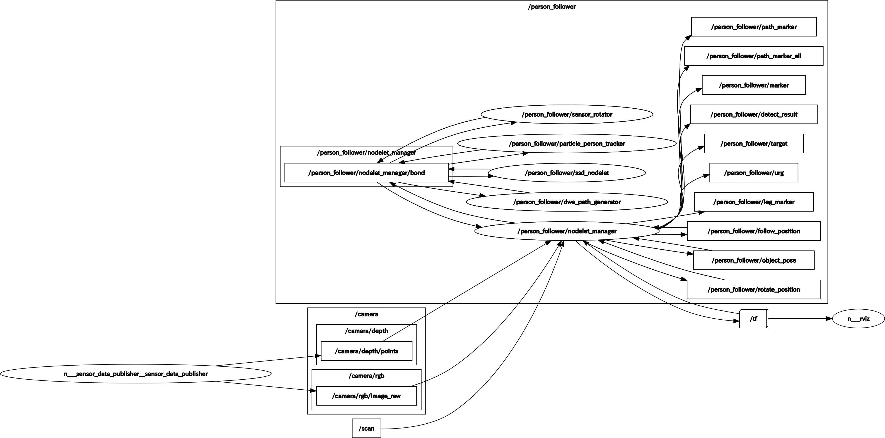

# SOBIT Follower4

RGB-Dセンサ(xtion)とLRF(URG)を組み合わせた人追従プログラム(Nodelet版)

## Before Use
必要なパッケージをインストール
- ros-melodic-pointcloud-to-laserscan
- pcl_handle
- libsvm_catkin
- libsvm_handle
- libsvm_tutorial
- svdd_lrf_leg_tracker
- ssd_node

```bash
$ bash ~/catkin_ws/src/sobit_follower4/install.sh 
```

## How to Use
### 1. Single Shot MultiBox Detector × Particle Filter([Paper](doc/sdd_particle_filter_person_follower.pdf))
- Single Shot MultiBox Detectorによる画像人認識
- Particle Filterによる点群脚追跡
- センサのパンチルト追従機能

    ロボットの「minimal.launch」「3dsensor.launch」「urg.launch」を起動すること

```bash
$ roslaunch person_follower4 particle_person_follower.launch
```

### 2. Single Shot MultiBox Detector × Particle Filter × Support Vector Data Description([Paper]())
- Single Shot MultiBox Detectorによる画像人認識
- Support Vector Data Descriptionによる点群脚認識([GitLab](https://gitlab.com/TeamSOBITS/svdd_lrf_leg_tracker))
- Particle Filterによる点群脚追跡
- センサのパンチルト追従機能

    ロボットの「minimal.launch」「3dsensor.launch」「urg.launch」を起動すること

```bash
$ roslaunch person_follower4 svdd_particle_person_follower.launch
```

<div align="center"></div>
