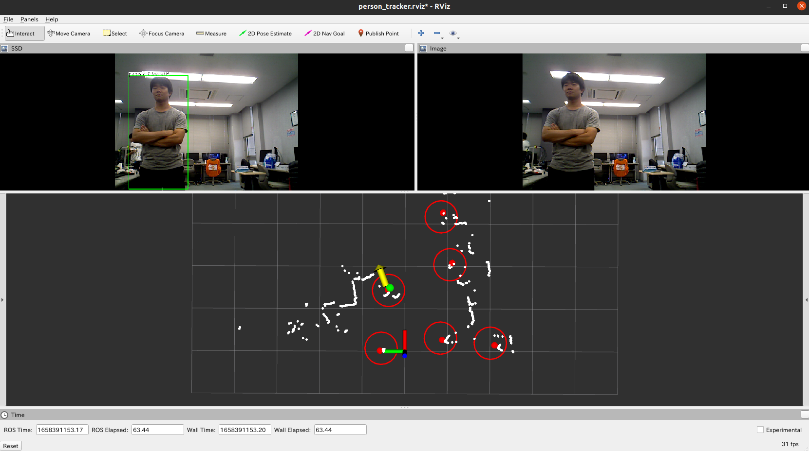
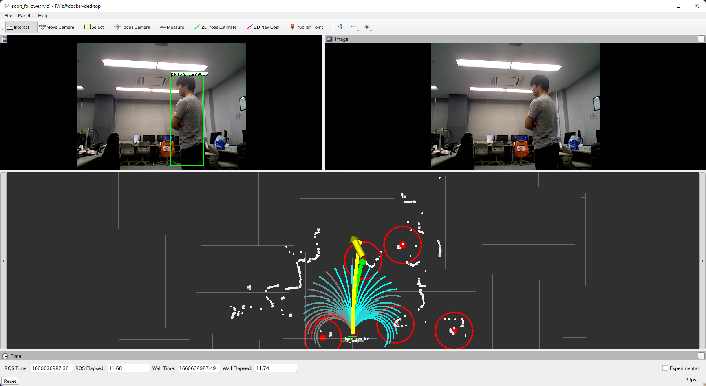

# SOBIT Follower (version 5.0)
- 複数のセンサを用いたロボットの人追従走行システム(SOBIT EDUのみ使用可能)
- [要旨](sobit_follower/doc/murakami_daiki_Master_research_summary.pdf)

<div align="center">
    
    
</div>

## Setup
- 以下を行ってください

※sobit_eduでfollow_meをする場合
```python
$ cd ~/catkin_ws/src/
$ git clone https://github.com/TeamSOBITS/sobit_follower
$ cd sobit_follower
$ bash install.sh
$ cd ~/catkin_ws
$ catkin_make
```
※sobit_proでfollow_meをする場合（sobit_pro用のbranchを指定する）
```python
$ cd ~/catkin_ws/src/
$ git clone -b sobit_pro/develop https://github.com/TeamSOBITS/sobit_follower
$ cd sobit_follower
$ bash install.sh
$ cd ~/catkin_ws
$ catkin_make
```
- 次に、weght_fileを入れる
    1. 共有新サーバーの、Competitions/RoboCup/RCJP2023/COMMON/lerning_data/2d_lidar_person_detection内にあるweight_fileをコピーする
    2. catkin_ws/src/sobit_follower/dr_spaam_ros/の中にペーストする
    （※学習データなので、git cloneなどではなく、コピー&ペーストで良い）

## Package Configuration
### 01. 2D Lidar Person Detection
- DR-SPAAMによる2次元点群脚検出
- [GitHub：Person Detection in 2D Range Data](https://github.com/VisualComputingInstitute/2D_lidar_person_detection)をPython3で動作するように改良したもの
- Multiple Sensor Person Trackingで使用
- 詳細は[こちら](2d_lidar_person_detection)

### 02. Multiple Observation Kalman Filter
- 2つの観測値を入力とするカルマンフィルタライブラリ
- 1つの観測値でも動作可能
-　状態方程式は等速モデル
- Multiple Sensor Person Trackingで使用
- 詳細は[こちら](multiple_observation_kalman_filter)

### 03. Multiple Sensor Person Tracking
- 2D-LiDARセンサ(URG)とパンチルト回転機構上のRGB-Dセンサ(xtion)を組み合わせた人物追跡
- DR-SPAAMによる2次元点群脚検出とSSDによる画像人検出を用いた人物追跡
- 詳細は[こちら](multiple_sensor_person_tracking)

<!-- <div align="center">
    
</div> -->

### 04. Person Following Control
- 仮想ばねモデルを用いた人間追従制御にDynamic Window Approachによる障害物回避を組み込んだ走行制御
- 詳細は[こちら](person_following_control)

<!-- <div align="center">
    
</div> -->

### 05. SOBIT Follower
- Multiple Sensor Person TrackingとPerson Following Controlを用いた人追従走行
- ユーザはこのパッケージのLaunchを起動することで人追従走行を動作させることが可能
- 実験用のrosbag取得や取得したデータのplotも可能なシェルスクリプトも完備
- 詳細は[こちら](sobit_follower)

## How to Use
### [follower_me.launch](sobit_follower/launch/follower_me.launch)
- Multiple Sensor Person TrackingとPerson Following Controlを用いた人追従走行
- path：`sobit_follower/launch/follower_me.launch`
- 詳細は[こちら](sobit_follower)
```python
$ roslaunch sobit_follower follower_me.launch rviz:=false rqt_reconfigure:=false use_rotate:=true use_smoother:=true
# 引数
# rviz : Rvizを起動するか(bool)
# rqt_reconfigure : rqt_reconfigureを起動するか(bool)
# use_rotate : SensorRotatorを起動するか(bool)
# use_smoother : 速度の平滑化を行うか(bool)
```
※SOBIT EDU，RGB-Dセンサ，2D LiDARの起動をすること

#### Launch Configuration
- [tracker.launch.xml](sobit_follower/launch/include/tracker.launch.xml)
    - 2D-LiDARセンサ(URG)とパンチルト回転機構上のRGB-Dセンサ(xtion)を組み合わせた人物追跡
    - path：`sobit_follower/launch/include/tracker.launch.xml`
    - 詳細は[こちら](sobit_follower#trackerlaunchxml)
- [ssd_pose_ros.launch.xml](sobit_follower/launch/include/ssd_pose_ros.launch.xml)
    - RGB画像ベースの人物検出器
    - path：`sobit_follower/launch/include/ssd_pose_ros.launch.xml`
    - 詳細は[こちら](sobit_follower#ssd_pose_roslaunchxml)
- [dr_spaam_ros.launch.xml](sobit_follower/launch/include/dr_spaam_ros.launch.xml)
    - 2D LiDARベースの人物検出器
    - path：`sobit_follower/launch/include/dr_spaam_ros.launch.xml`
    - 詳細は[こちら](sobit_follower#dr_spaam_roslaunchxml)
- [person_following_control.launch.xml](sobit_follower/launch/include/person_following_control.launch.xml)
    - 仮想ばねモデルを用いた追従制御にDynamic Window Approachによる障害物回避を組み込んだ走行制御
    - path：`sobit_follower/launch/include/person_following_control.launch.xml`
    - 詳細は[こちら](sobit_follower#person_following_controllaunchxml)

#### Parameter file
- [tracker_param.yaml](sobit_follower/param/tracker_param.yaml)
    - 人物追跡に関するパラメータ
    - path：`sobit_follower/param/tracker_param.launch.xml`
    - パラメータの詳細は[こちら](sobit_follower#parametersperson_tracker)
- [ssd_param.yaml](sobit_follower/param/ssd_param.yaml)
    - RGB画像ベースの人物検出器に関するパラメータ
    - path：`sobit_follower/param/ssd_param.launch.xml`
    - パラメータの詳細は[こちら](sobit_follower#parameters)
- [dr_spaam_param.yaml](sobit_follower/param/dr_spaam_param.yaml)
    - 2D LiDARベースの人物検出器に関するパラメータ
    - path：`sobit_follower/param/dr_spaam_param.launch.xml`
    - パラメータの詳細は[こちら](sobit_follower#parameters-1)
- [sensor_rotator_param.yaml](sobit_follower/param/sensor_rotator_param.yaml)
    - RGB-Dセンサのパンチルト回転制御に関するパラメータ
    - path：`sobit_follower/param/sensor_rotator_param.launch.xml`
- [following_control_param.yaml](sobit_follower/param/following_control_param.yaml)
    - 走行制御に関するパラメータ
    - path：`sobit_follower/param/following_control_param.launch.xml`
    - パラメータの詳細は[こちら](sobit_follower##parameterfollowing-control)
- [velocity_smoother_param.yaml](sobit_follower/param/velocity_smoother_param.yaml)
    - 速度平滑化に関するパラメータ
    - path：`sobit_follower/param/velocity_smoother_param.launch.xml`

### [simulator.launch](sobit_follower/launch/simulator.launch)
- 仮想的にセンサデータをパブリッシュして，follower_me.launchの動作を確認
- path：`sobit_follower/launch/simulator.launch`
```python
$ roslaunch sobit_follower simulator.launch rviz:=true rqt_reconfigure:=true
# 引数
# rviz : Rvizを起動するか(bool)
# rqt_reconfigure : rqt_reconfigureを起動するか(bool)
```
<div align="center">
    
</div>
