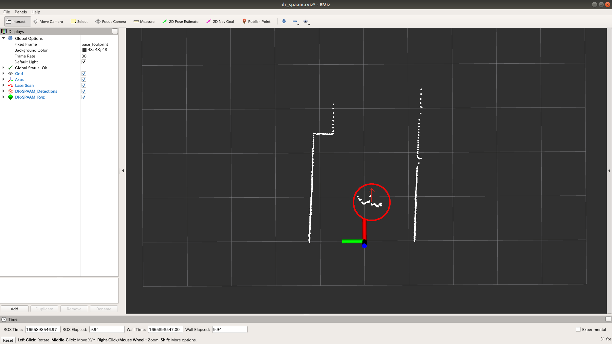
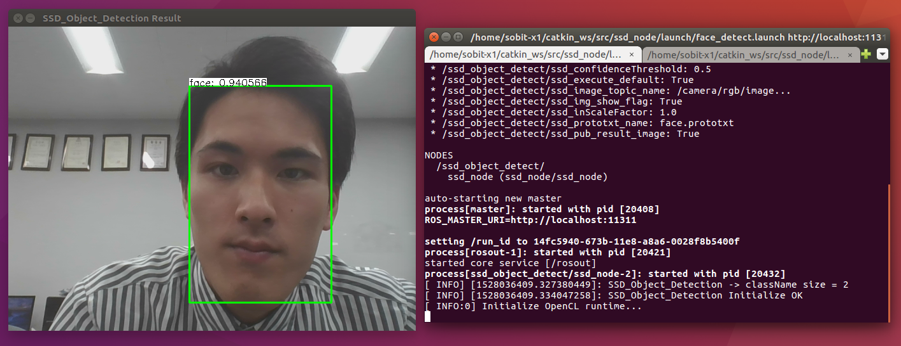
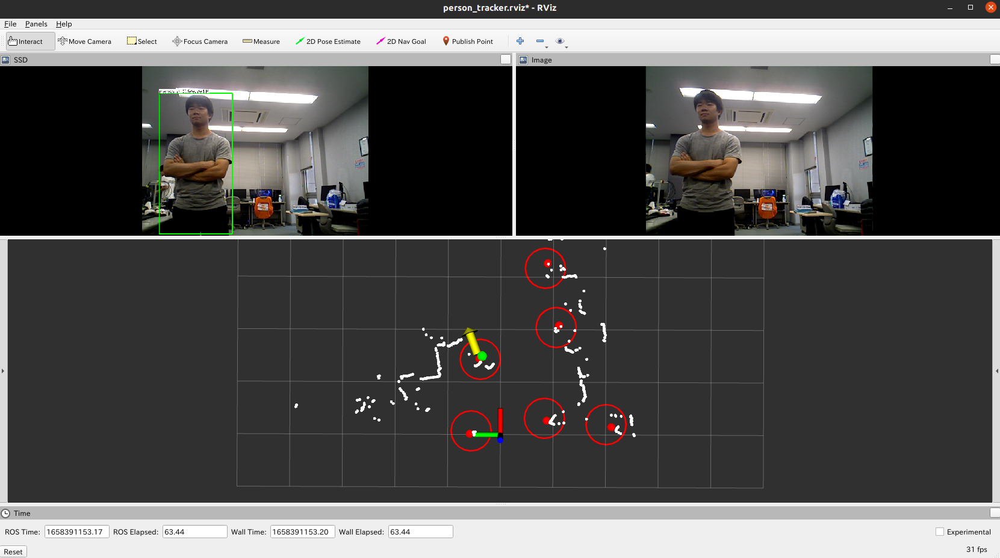

# Multiple Sensor Person Tracking
- 2D-LiDARセンサ(URG)とパンチルト回転機構上のRGB-Dセンサ(xtion)を組み合わせた人物追跡
- DR-SPAAMによる2次元点群脚検出とSSDによる画像人検出を用いた人物追跡

## software configuration
### Person detection by 2D-LiDAR
- DR-SPAAM（Distance Robust SPatial Attention and Auto-regressive Model）
    - 空間的注意と自己回帰モデルを用いた高速な2D LiDARベースの人物検出器
        - CNNベースの人物検出器である[DROW (Distance RObust Wheelchair/Walker)](https://arxiv.org/abs/1603.02636)を自動回帰モデルで拡張
            - [DROWの論文の日本語訳](doc/DROW_Japanese.pdf)
    - 2次元レンジデータに基づく人物検出において、速度と検出性能の両方で、従来の最先端技術を凌駕
    - [論文：DR-SPAAM: A Spatial-Attention and Auto-regressive Model for Person Detection in 2D Range Data](https://arxiv.org/abs/2004.14079)
        - [日本語訳](doc/DR-SPAAM_Japanese.pdf)
    - [GitHub：Person Detection in 2D Range Data](https://github.com/VisualComputingInstitute/2D_lidar_person_detection)
        - 本パッケージに，Python3で動作するように改良したものがあります（[2d_lidar_person_detection](2d_lidar_person_detection)）
        - そのディレクトリ内のREADMEは，本パッケージと関係ありません

### Person detection by RGB-D sensor
- SSD（Single Shot Multibox Detector）
    - １度のCNN演算で物体の「領域候補検出」と「クラス分類」の両方を行う手法
    - 物体検出処理の高速化を可能にした
    - [論文：SSD: Single Shot MultiBox Detector](https://arxiv.org/abs/1512.02325)
    - [GitHub：SSD Nodelet](https://gitlab.com/TeamSOBITS/ssd_nodelet)

### Tracking
- Kalman Filter
    - 2D-LiDARからの人の観測値とRGB-Dセンサからの人の観測値を入力とし、等速モデルによる状態方程式と組み合わせて、次の人の位置を推定することで追跡する．

### Pan Tilt Control
- パンチルト回転機構上のRGB-Dセンサを追跡対象の方向に回転させる

## Setup
```bash
$ cd ~/catkin_ws/src/
$ git clone https://gitlab.com/TeamSOBITS/multiple_sensor_person_tracking.git
$ cd multiple_sensor_person_tracking
$ bash install.sh
```

## How to Use
### DR-SPAAM ROS
DR-SPAAMによる人検出を行う
```bash
$ roslaunch multiple_sensor_person_tracking dr_spaam_ros.launch
```
```bash
# デモ用
$ roslaunch multiple_sensor_person_tracking dr_spaam_demo.launch
```
<div align="center">
    
</div>

#### Node
|ノード名|意味|
|---|---|
|/dr_spaam/dr_spaam_ros|DR-SPAAMによる人検出|

#### Subscriptions
|トピック名|型|意味|
|---|---|---|
|/scan|sensor_msgs/LaserScan|入力スキャン|

#### Publications
|トピック名|型|意味|
|---|---|---|
|/dr_spaam_detections|multiple_sensor_person_tracking/LegPoseArray|検出結果|

※デモ用では、「geometry_msgs/PoseArray」になります

#### Parameters
|パラメータ名|型|意味|
|---|---|---|
|/detector_model|string|モデル名(DROW3 or DR-SPAAM)|
|/weight_file|string|重みファイルパス|
|/conf_thresh|double|信頼度の閾値|
|/stride|int|ストライド間隔|
|/panoramic_scan|bool|スキャンが360度をカバーするか|

### SSD ROS
SSDによる人検出を行う
```bash
$ roslaunch multiple_sensor_person_tracking ssd_ros.launch
# camera_720p_16_9.launchを使うことで，Webカメラから画像がパブリッシュされる
$ roslaunch multiple_sensor_person_tracking camera_720p_16_9.launch
```
<div align="center">
    
</div>

#### Node
|ノード名|意味|
|---|---|
|/ssd_object_detect/ssd_nodelet_manager|SSDのノードレットの管理|
|/ssd_object_detect/ssd_nodelet|SSDによる人検出|

#### Subscriptions
|トピック名|型|意味|
|---|---|---|
|/camera/depth/points|sensor_msgs/PointCloud2|入力点群|
|/camera/rgb/image_raw|sensor_msgs/Image|入力画像|
|/ssd_object_detect/detect_ctrl|std_msgs/Bool|検出のオンオフ|

#### Publications
|トピック名|型|意味|
|---|---|---|
|/ssd_object_detect/detect_result|sensor_msgs/Image|検出結果(画像)|
|/ssd_object_detect/object_name|sobit_common_msg/StringArray|検出結果(物体名)|
|/ssd_object_detect/object_rect|sobit_common_msg/BoundingBoxes|検出結果(バウンディングボックス)|
|/ssd_object_detect/object_pose|sobit_common_msg/ObjectPoseArray|検出結果(３次元位置)|

#### Parameters
|パラメータ名|型|意味|
|---|---|---|
|/ssd_prototxt_name|string|prototxtファイルパス|
|/ssd_caffemodel_name|string|caffemodelファイルパス|
|/ssd_class_names_file|string|namesファイルパス|
|/ssd_image_topic_name|string|入力画像のトピック名|
|/ssd_cloud_topic_name|string|入力点群のトピック名|
|/target_frame|string|基準座標フレーム名|
|/ssd_in_scale_factor|double|Caffeで扱うBlob形式の変換時のスケールパラメータ|
|/ssd_confidence_threshold|double|検出結果リストに追加される結果の信頼度の閾値|
|/object_specified_enabled|bool|特定の物体のみ検出を行うか|
|/specified_object_name|string|検出する特定の物体名(物体ラベルにない名前は却下されます)|
|/ssd_img_show_flag|bool|検出画像の描画をするか|
|/ssd_execute_default|bool|起動時に検出を開始するか|
|/ssd_pub_result_image|bool|/detect_resultをパブリッシュをするかどうか|
|/use_tf|bool|tfによる座標登録するか|

### Multiple Sensor Person Tracking
```bash
$ roslaunch multiple_sensor_person_tracking tracker.launch
# sensor_data_publisher.launchを使うことで，擬似的にスキャンデータをパブリッシュすることができる
$ roslaunch virtual_multiple_sensor_publisher sensor_data_publisher.launch
```
<div align="center">
    
</div>

#### Node
|ノード名|意味|
|---|---|
|/multiple_sensor_person_tracking/tracker_nodelet_manager|追跡器のノードレットの管理|
|/multiple_sensor_person_tracking/person_tracker|DR-SPAAMによる2次元点群脚検出とSSDによる画像人検出を用いた人物追跡|
|/multiple_sensor_person_tracking/sensor_rotator|パンチルト回転機構上のRGB-Dセンサを追跡対象の方向に回転|

#### Subscriptions
|トピック名|型|意味|
|---|---|---|
|/dr_spaam_detections|multiple_sensor_person_tracking/LegPoseArray|検出結果|
|/ssd_object_detect/object_pose|sobit_common_msg/ObjectPoseArray|検出結果(３次元位置)|

#### Publications
|トピック名|型|意味|
|---|---|---|
|/multiple_sensor_person_tracking/following_position|multiple_sensor_person_tracking/FollowingPosition|追従位置と障害物|
|/multiple_sensor_person_tracking/obstacles|sensor_msgs/PointCloud2|障害物点群|
|/multiple_sensor_person_tracking/tracker_marker|visualization_msgs/MarkerArray|検出結果のマーカ|

#### Parameters(person_tracker)
|パラメータ名|型|意味|
|---|---|---|
|/dr_spaam_topic_name|string|DR-SPAAMのトピック名|
|/ssd_topic_name|string|SSDのトピック名|
|/target_frame|string|基準フレーム名|
|/target_range|double|追跡対象を決定するときの最大範囲[m]|
|/leg_tracking_range|double|前フレームの推定値から人検出結果を観測値とする範囲(脚)[m]|
|/body_tracking_range|double|前フレームの推定値から人検出結果を観測値とする範囲(体)[m]|
|/target_cloud_radius|double|追跡位置から追跡点群とする半径[m]|
|/process_noise|double|カルマンフィルタのプロセスノイズQ|
|/system_noise|double|カルマンフィルタのシステムノイズR|
|/outlier_radius|double|外れ値探索半径[m]|
|/outlier_min_pts|int|外れ値探索の最小点数|
|/leaf_size|double|ダウンサンプリング間隔[m]|
|/display_marker|bool|追跡Rvizマーカーを描画するか|

#### Parameters(sensor_rotator)
|パラメータ名|型|意味|
|---|---|---|
|/following_position_topic_name|string|following_positionのトピック名|
|/tilt_angle_min_deg|double|チルト方向の最小角度[deg]|
|/tilt_angle_max_deg|double|チルト方向の最大角度[deg]|
|/camera2person_height|double|カメラと人の頭の距離[m]|
|/use_rotate|bool|センサを回転させるか|
|/use_smoothing|bool|平滑化するか|
|/smoothing_gain|double|平滑化ゲイン|
