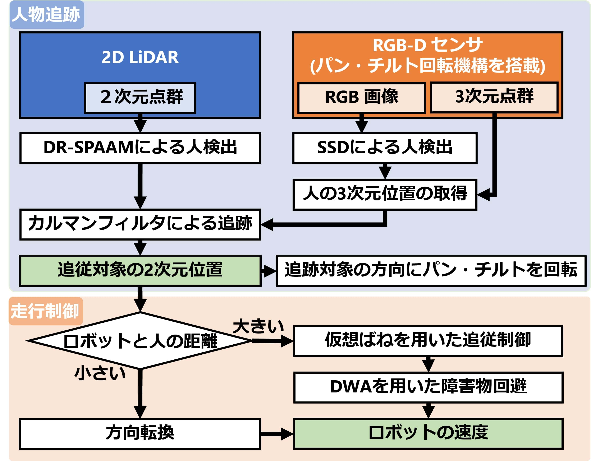

<a name="readme-top"></a>

[JA](README.md) | [EN](README.en.md)

[![Contributors][contributors-shield]][contributors-url]
[![Forks][forks-shield]][forks-url]
[![Stargazers][stars-shield]][stars-url]
[![Issues][issues-shield]][issues-url]
[![License][license-shield]][license-url]

# SOBIT Follower
---
<!-- 目次 -->
<details>
  <summary>目次</summary>
  <ol>
    <li>
      <a href="#概要">概要</a>
    </li>
    <li>
      <a href="#実行方法">実行方法</a>
    </li>
    <li>
      <a href="#構成">構成</a>
      <ul>
        <li><a href="#trackerlaunchxml">tracker.launch.xml</a></li>
        <li><a href="#ssd_pose_roslaunchxml">ssd_pose_ros.launch.xml</a></li>
        <li><a href="#dr_spaam_roslaunchxml">dr_spaam_ros.launch.xml</a></li>
        <li><a href="#person_following_controllaunchxml">person_following_control.launch.xml</a></li>
      </ul>
    </li>
    <li><a href="#マイルストーン">マイルストーン</a></li>
  </ol>
</details>

---
## 概要
- Multiple Sensor Person TrackingとPerson Following Controlを用いた人追従走行
- ユーザはこのパッケージのLaunchを起動することで人追従走行を動作させることが可能
- 実験用のrosbag取得や取得したデータのplotも可能なシェルスクリプトも完備

<div align="center">
    
    
</div>

## 実行方法
### [sobit_edu_follower_me.launch](launch/sobit_edu/sobit_edu_follower_me.launch)
- SOBIT EDUを用いた人追従走行
- path：`sobit_follower/launch/sobit_edu/sobit_edu_follower_me.launch`
```python
$ roslaunch sobit_follower sobit_edu_follower_me.launch rviz:=false rqt_reconfigure:=false use_rotate:=true use_smoother:=true
# 引数
# rviz : Rvizを起動するか(bool)
# rqt_reconfigure : rqt_reconfigureを起動するか(bool)
# use_rotate : SensorRotatorを起動するか(bool)
# use_smoother : 速度の平滑化を行うか(bool)
```
※SOBIT EDU，RGB-Dセンサ，2D LiDARの起動をすること

### [sobit_pro_follower_me.launch](launch/sobit_pro/sobit_pro_follower_me.launch)
- SOBIT PROを用いた人追従走行
- path：`sobit_follower/launch/sobit_pro/sobit_pro_follower_me.launch`
```python
$ roslaunch sobit_follower sobit_pro_follower_me.launch rviz:=false rqt_reconfigure:=false use_rotate:=true use_smoother:=true
# 引数
# rviz : Rvizを起動するか(bool)
# rqt_reconfigure : rqt_reconfigureを起動するか(bool)
# use_rotate : SensorRotatorを起動するか(bool)
# use_smoother : 速度の平滑化を行うか(bool)
```
※SOBIT PRO，RGB-Dセンサ，2D LiDARの起動をすること


## 構成
### tracker.launch.xml
- #### [sobit_edu_tracker.launch.xml](launch/include/sobit_edu/sobit_edu_tracker.launch.xml)
- #### [sobit_pro_tracker.launch.xml](launch/include/sobit_pro/sobit_pro_tracker.launch.xml)
#### Node
|ノード名|意味|
|---|---|
|/multiple_sensor_person_tracking/tracker_nodelet_manager|追跡器のノードレットの管理|
|/multiple_sensor_person_tracking/person_tracker|DR-SPAAMによる2次元点群脚検出とSSDによる画像人検出を用いた人物追跡|
|/multiple_sensor_person_tracking/sensor_rotator|パンチルト回転機構上のRGB-Dセンサを追跡対象の方向に回転|

#### Subscriptions
|トピック名|型|意味|
|---|---|---|
|/dr_spaam_detections|multiple_sensor_person_tracking/LegPoseArray|検出結果|
|/ssd_object_detect/object_pose|sobits_msgs/ObjectPoseArray|検出結果(３次元位置)|

#### Publications
|トピック名|型|意味|
|---|---|---|
|/multiple_sensor_person_tracking/following_position|multiple_sensor_person_tracking/FollowingPosition|追従位置と障害物|
|/multiple_sensor_person_tracking/obstacles|sensor_msgs/PointCloud2|障害物点群|
|/multiple_sensor_person_tracking/tracker_marker|visualization_msgs/MarkerArray|検出結果のマーカ|

#### Parameters(person_tracker)
|パラメータ名|型|意味|
|---|---|---|
|/dr_spaam_topic_name|string|DR-SPAAMのトピック名|
|/ssd_topic_name|string|SSDのトピック名|
|/target_frame|string|基準フレーム名|
|/target_range|double|追跡対象を決定するときの最大範囲[m]|
|/leg_tracking_range|double|前フレームの推定値から人検出結果を観測値とする範囲(脚)[m]|
|/body_tracking_range|double|前フレームの推定値から人検出結果を観測値とする範囲(体)[m]|
|/target_cloud_radius|double|追跡位置から追跡点群とする半径[m]|
|/target_change_tolerance|double|追跡対象を変更する時間[s]|
|/process_noise|double|カルマンフィルタのプロセスノイズQ|
|/system_noise|double|カルマンフィルタのシステムノイズR|
|/outlier_radius|double|外れ値探索半径[m]|
|/outlier_min_pts|int|外れ値探索の最小点数|
|/leaf_size|double|ダウンサンプリング間隔[m]|
|/display_marker|bool|追跡Rvizマーカーを描画するか|

#### Parameters(sensor_rotator)
|パラメータ名|型|意味|
|---|---|---|
|/following_position_topic_name|string|following_positionのトピック名|
|/tilt_angle_min_deg|double|チルト方向の最小角度[deg]|
|/tilt_angle_max_deg|double|チルト方向の最大角度[deg]|
|/camera2person_height|double|カメラと人の頭の距離[m]|
|/use_rotate|bool|センサを回転させるか|
|/use_smoothing|bool|平滑化するか|
|/smoothing_gain|double|平滑化ゲイン|

#### Parameter file
- [tracker_param.yaml](param/tracker_param.yaml)
    - 人物追跡に関するパラメータ
    - path：`sobit_follower/param/tracker_param.launch.xml`
- [sensor_rotator_param.yaml](param/sensor_rotator_param.yaml)
    - RGB-Dセンサのパンチルト回転制御に関するパラメータ
    - path：`sobit_follower/param/sensor_rotator_param.launch.xml`

### ssd_pose_ros.launch.xml
- #### [ssd_pose_ros.launch.xml](launch/include/ssd_pose_ros.launch.xml)
  - RGB画像ベースの人物検出器
  - path：`sobit_follower/launch/include/ssd_pose_ros.launch.xml`

#### Node
|ノード名|意味|
|---|---|
|/ssd_object_detect/ssd_nodelet_manager|SSDのノードレットの管理|
|/ssd_object_detect/ssd_nodelet|SSDによる人検出|

#### Subscriptions
|トピック名|型|意味|
|---|---|---|
|/camera/depth/points|sensor_msgs/PointCloud2|入力点群|
|/camera/camera/rgb/image_raw|sensor_msgs/Image|入力画像|
|/ssd_object_detect/detect_ctrl|std_msgs/Bool|検出のオンオフ|

#### Publications
|トピック名|型|意味|
|---|---|---|
|/ssd_object_detect/detect_result|sensor_msgs/Image|検出結果(画像)|
|/ssd_object_detect/object_name|sobits_msgs/StringArray|検出結果(物体名)|
|/ssd_object_detect/object_rect|sobits_msgs/BoundingBoxes|検出結果(バウンディングボックス)|
|/ssd_object_detect/object_pose|sobits_msgs/ObjectPoseArray|検出結果(３次元位置)|

#### Parameters
|パラメータ名|型|意味|
|---|---|---|
|/ssd_prototxt_name|string|prototxtファイルパス|
|/ssd_caffemodel_name|string|caffemodelファイルパス|
|/ssd_class_names_file|string|namesファイルパス|
|/ssd_image_topic_name|string|入力画像のトピック名|
|/ssd_cloud_topic_name|string|入力点群のトピック名|
|/target_frame|string|基準座標フレーム名|
|/ssd_in_scale_factor|double|Caffeで扱うBlob形式の変換時のスケールパラメータ|
|/ssd_confidence_threshold|double|検出結果リストに追加される結果の信頼度の閾値|
|/object_specified_enabled|bool|特定の物体のみ検出を行うか|
|/specified_object_name|string|検出する特定の物体名(物体ラベルにない名前は却下されます)|
|/ssd_img_show_flag|bool|検出画像の描画をするか|
|/ssd_execute_default|bool|起動時に検出を開始するか|
|/ssd_pub_result_image|bool|/detect_resultをパブリッシュをするかどうか|
|/use_tf|bool|tfによる座標登録するか|

#### Parameter file
- [ssd_param.yaml](param/ssd_param.yaml)
    - RGB画像ベースの人物検出器に関するパラメータ
    - path：`sobit_follower/param/ssd_param.launch.xml`

### dr_spaam_ros.launch.xml
- #### [dr_spaam_ros.launch.xml](launch/include/dr_spaam_ros.launch.xml)
  - 2D LiDARベースの人物検出器
  - path：`sobit_follower/launch/include/dr_spaam_ros.launch.xml`

#### Node
|ノード名|意味|
|---|---|
|/dr_spaam/dr_spaam_ros|DR-SPAAMによる人検出|

#### Subscriptions
|トピック名|型|意味|
|---|---|---|
|/scan|sensor_msgs/LaserScan|入力スキャン|

#### Publications
|トピック名|型|意味|
|---|---|---|
|/dr_spaam_detections|multiple_sensor_person_tracking/LegPoseArray|検出結果|

※デモ用では、「geometry_msgs/PoseArray」になります

#### Parameters
|パラメータ名|型|意味|
|---|---|---|
|/detector_model|string|モデル名(DROW3 or DR-SPAAM)|
|/weight_file|string|重みファイルパス|
|/conf_thresh|double|信頼度の閾値|
|/stride|int|ストライド間隔|
|/panoramic_scan|bool|スキャンが360度をカバーするか|

#### Parameter file
- [dr_spaam_param.yaml](param/dr_spaam_param.yaml)
    - 2D LiDARベースの人物検出器に関するパラメータ
    - path：`sobit_follower/param/dr_spaam_param.launch.xml`

### person_following_control.launch.xml
- #### [sobit_edu_person_following_control.launch.xml](launch/include/sobit_edu/sobit_edu_person_following_control.launch.xml)
- #### [sobit_pro_person_following_control.launch.xml](launch/include/sobit_pro/sobit_pro_person_following_control.launch.xml)
  - 仮想ばねモデルを用いた人間追従制御にDynamic Window Approachによる障害物回避を組み込んだ走行制御
  - path：`sobit_follower/launch/include/person_following_control.launch.xml`

#### Node
|ノード名|意味|
|---|---|
|/person_following_control/following_control_nodelet_manager|追従制御のノードレットの管理|
|/person_following_control/person_following_control|追従制御|

#### Subscriptions
|トピック名|型|意味|
|---|---|---|
|/multiple_sensor_person_tracking/following_position|multiple_sensor_person_tracking/FollowingPosition|追従位置と障害物|

#### Publications
|トピック名|型|意味|
|---|---|---|
|/cmd_vel_mux/input/teleop|multiple_sensor_person_tracking/FollowingPosition|追従制御の速度情報|

#### Parameter：Following Control
|パラメータ名|型|意味|
|---|---|---|
|/base_footprint_name|string|基準フレーム名|
|/following_distance|double|人と保つ距離 ( l_0 [m] )|
|/following_method|int|追従手法|

##### following_method
```
0 : VirtualSpringModel-DynamicWindowApproach
1 : VirtualSpringModel
2 : DynamicWindowApproach
3 : PIDController
```

#### Parameter：Virtual Spring Model
|パラメータ名|型|意味|
|---|---|---|
|/following_angle_deg|double|追従位置の角度 ( theta_sh [deg] )|
|/spring_constant_linear|double|ばね定数(並進成分) ( k_1 [N/m] )|
|/spring_constant_angular|double|ばね定数(回転成分) ( k_2 [N・m/rad] )|
|/weight_robot|double|ロボットの重量 ( M [Kg] )|
|/moment_inertia|double|慣性モーメント ( I [Kg・m^2] )|
|/viscous_friction_linear|double|粘性摩擦(並進成分) ( k_3 [N・s/m] )|
|/viscous_friction_angular|double|粘性摩擦(回転成分) ( k_4 [N・s/rad] )|
|/radius_robot|double|ロボット半径 ( L [m] )|
|/display_vsm_path|bool|経路を描画するか|
|/display_vsm_target|bool|目標位置を描画するか|

#### Parameter：Dynamic Window Approach
|パラメータ名|型|意味|
|---|---|---|
|/min_linear|double|最小並進速度 [m/s]|
|/max_linear|double|最大並進速度 [m/s]|
|/min_angular_deg|double|最小回転速度 [deg/s]|
|/max_angular_deg|double|最大回転速度 [deg/s]|
|/predict_step|int|予測ステップ数|
|/sampling_time|double|サンプリングタイム(1予測ステップの時間)|
|/velocity_step|double|並進速度の予測経路数|
|/angle_velocity_step|double|回転速度の予測経路数|
|/weight_heading|double|heading(v,ω)の重み(DWAで使用)|
|/weight_obstacle|double|obstacle(v,ω)の重み(DWAで使用)|
|/weight_velocity|double|velocity(v,ω)の重み(DWAで使用)|
|/weight_vsm_heading|double|heading(v,ω)の重み(VSM-DWAで使用)|
|/weight_vsm_obstacle|double|obstacle(v,ω)の重み(VSM-DWAで使用)|
|/weight_vsm_linear|double|linear(v,ω)の重み(VSM-DWAで使用)|
|/weight_vsm_angular|double|angular(v,ω)の重み(VSM-DWAで使用)|
|/obstacle_cost_radius|double|障害物コスト[m]|
|/display_optimal_path|bool|最適経路を描画するか|
|/display_all_path|bool|予測経路を描画するか|

##### 評価関数について
- DWAの評価関数
```
G(v,ω) = α * heading(v,ω) + β * obstacle(v,ω) + γ * velocity(v,ω)
```
- VSM-DWAの評価関数
```
G(v,ω) = α * heading(v,ω) + β * obstacle(v,ω) + γ * linear(v,ω) + δ * angular(v,ω)
```
※ α，β，γ，δ：重みパラメータ

|項|意味|
|---|---|
|heading(v,ω)：方向項|・制御入力の時のロボットの方位とゴール方向の差の角度を180度から引いた値<br>・ロボットがゴールに真っ直ぐ向かっている場合は，方向項の値は大きくなる|
|obstacle(v,ω)：障害物距離項<br>※DWAの論文でのdist(v,ω)と同義|・制御入力の時の最近傍の障害物までの距離の値<br>・障害物から遠い制御入力の障害物距離項の値が大きくなる|
|velocity(v,ω)：速度項|・制御入力の並進速度の値<br>・速度が早い制御入力の速度項の値が大きくなる|
|linear(v,ω)：VSM並進速度項|・制御入力の並進速度と仮想ばねモデルで得た並進速度の差の逆数値<br>・仮想ばねモデルで得た並進速度と一致する制御入力の速度項の値が大きくなる|
|angular(v,ω)：VSM回転速度項|・制御入力の回転速度と仮想ばねモデルで得た回転速度の差の逆数値<br>・仮想ばねモデルで得た回転速度と一致する制御入力の速度項の値が大きくなる|

#### Parameter：PID Controller
|パラメータ名|型|意味|
|---|---|---|
|/p_gain|double|比例制御ゲイン|
|/i_gain|double|積分制御ゲイン|
|/d_gain|double|微分制御ゲイン|
|/max_pid_angular_deg|double|最大回転速度|

#### Parameter file
- [following_control_param.yaml](param/following_control_param.yaml)
    - 走行制御に関するパラメータ
    - path：`sobit_follower/param/following_control_param.launch.xml`
- [velocity_smoother_param.yaml](param/velocity_smoother_param.yaml)
    - 速度平滑化に関するパラメータ
    - path：`sobit_follower/param/velocity_smoother_param.launch.xml`

<!-- マイルストーン -->
## マイルストーン

- [x] OSS
    - [x] ドキュメンテーションの充実
    - [x] コーディングスタイルの統一

現時点のバッグや新規機能の依頼を確認するために[Issueページ][license-url] をご覧ください．

<p align="right">(<a href="#readme-top">上に戻る</a>)</p>

<!-- 参考文献 -->
<!-- ## 参考文献

* [Dynamixel SDK](https://emanual.robotis.com/docs/en/software/dynamixel/dynamixel_sdk/overview/)

<p align="right">(<a href="#readme-top">上に戻る</a>)</p> -->


<!-- CONTRIBUTING -->
<!-- ## Contributing

Contributions are what make the open source community such an amazing place to learn, inspire, and create. Any contributions you make are **greatly appreciated**.

If you have a suggestion that would make this better, please fork the repo and create a pull request. You can also simply open an issue with the tag "enhancement".
Don't forget to give the project a star! Thanks again!

1. Fork the Project
2. Create your Feature Branch (`git checkout -b feature/AmazingFeature`)
3. Commit your Changes (`git commit -m 'Add some AmazingFeature'`)
4. Push to the Branch (`git push origin feature/AmazingFeature`)
5. Open a Pull Request

<p align="right">(<a href="#readme-top">上に戻る</a>)</p> -->


<!-- LICENSE -->
<!-- ## License

Distributed under the MIT License. See `LICENSE.txt` for more NOTErmation.

<p align="right">(<a href="#readme-top">上に戻る</a>)</p> -->
<!-- MARKDOWN LINKS & IMAGES -->
<!-- https://www.markdownguide.org/basic-syntax/#reference-style-links -->
[contributors-shield]: https://img.shields.io/github/contributors/TeamSOBITS/sobit_follower.svg?style=for-the-badge
[contributors-url]: https://github.com/TeamSOBITS/sobit_follower/graphs/contributors
[forks-shield]: https://img.shields.io/github/forks/TeamSOBITS/sobit_follower.svg?style=for-the-badge
[forks-url]: https://github.com/TeamSOBITS/sobit_follower/network/members
[stars-shield]: https://img.shields.io/github/stars/TeamSOBITS/sobit_follower.svg?style=for-the-badge
[stars-url]: https://github.com/TeamSOBITS/sobit_follower/stargazers
[issues-shield]: https://img.shields.io/github/issues/TeamSOBITS/sobit_follower.svg?style=for-the-badge
[issues-url]: https://github.com/TeamSOBITS/sobit_follower/issues
[license-shield]: https://img.shields.io/github/license/TeamSOBITS/sobit_follower.svg?style=for-the-badge
[license-url]: LICENSE
